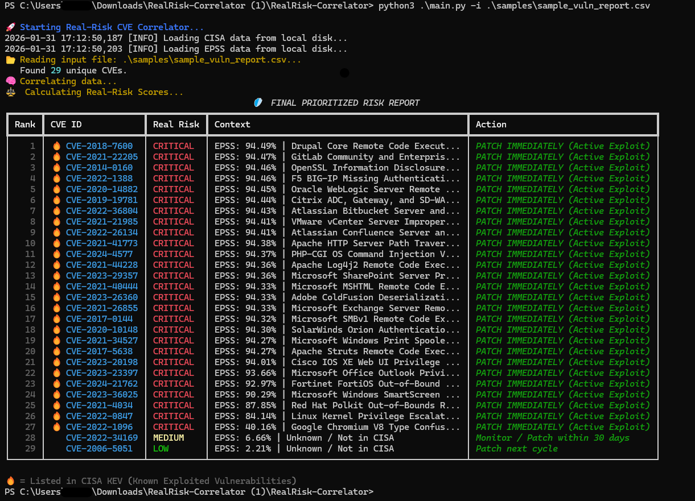

# RealRisk-Correlator 🛡️


**A Risk-Based Vulnerability Management (RBVM) engine that prioritizes security vulnerabilities based on Active Exploitation and Predictive Probability.**

---

## 🚨 The Problem
Security teams are suffering from **Alert Fatigue**. Standard scanners (Nessus, Qualys, OpenVAS) report thousands of "Critical" bugs based on static CVSS scores.
* **Fact:** Only ~5% of CVEs are ever actually exploited by hackers.
* **The Struggle:** Teams waste time patching theoretical risks while missing the real attacks.

## 🎯 The Solution
**RealRisk-Correlator** cuts through the noise. It ingests your raw scan results and enriches them with real-time Threat Intelligence to answer two questions:
1.  *"Are hackers using this bug right now?"* (**CISA KEV**)
2.  *"How likely is an attack in the next 30 days?"* (**EPSS Score**)

---

## 📸 Demo

*(The tool re-ranking vulnerabilities: Top priorities are active threats, regardless of CVSS score.)*

---

## ⚡ Key Features
* **Universal Ingestion:** Uses a robust Regex parser to find CVEs in *any* text file (CSV, JSON, Logs, TXT).
* **Real-Time Intel:** Auto-fetches the latest **CISA Known Exploited Vulnerabilities** catalog.
* **Predictive Scoring:** Integrates **FIRST.org EPSS** (Exploit Prediction Scoring System) to forecast future attacks.
* **Smart Caching:** Local caching system to respect API rate limits and allow offline usage.
* **Prioritized Reporting:** Generates a color-coded, ranked table focusing on **Business Risk**.

---

## 💡 Example Use Cases

### Scenario 1: "The Monday Morning Triage"
**Context:** Your weekly Nessus scan just finished and dropped a 500-page PDF with 2,000 "Critical" vulnerabilities.
**Action:** Run `RealRisk-Correlator` against the CSV export.
**Result:** The tool filters the list down to the **15 vulnerabilities** that are actually being exploited in the wild (CISA KEV), allowing your team to fix the most dangerous bugs before lunch.

### Scenario 2: "Zero-Day Panic Response"
**Context:** A new major vulnerability (like Log4Shell) hits the news. Twitter is panicking.
**Action:** Feed your asset inventory logs or recent scan files into the tool.
**Result:** Immediate confirmation if the specific CVEs in your environment are flagged as **CRITICAL (Active Exploit)** or if they are still just "Theoretical" risks, helping you decide whether to wake up the engineering team.

### Scenario 3: "Legacy System Review"
**Context:** You have old servers that can't be fully patched. You need to know which specific patches are non-negotiable.
**Action:** Scan the legacy server and process the results.
**Result:** You identify that out of 50 missing patches, only 3 have a high **EPSS probability score** (>20%). You patch those 3 and accept the risk for the rest, optimizing your limited maintenance window.

---

## 🚀 Installation

1.  **Clone the repository**
    ```bash
    git clone https://github.com/YourUsername/RealRisk-Correlator.git
    cd RealRisk-Correlator
    ```

2.  **Install Dependencies**
    ```bash
    pip install -r requirements.txt
    ```

---

## 💻 Usage

**1. Standard Scan (CSV, TXT, JSON)**
Process a vulnerability report from any scanner:
```bash
python main.py -i path/to/nessus_scan.csv